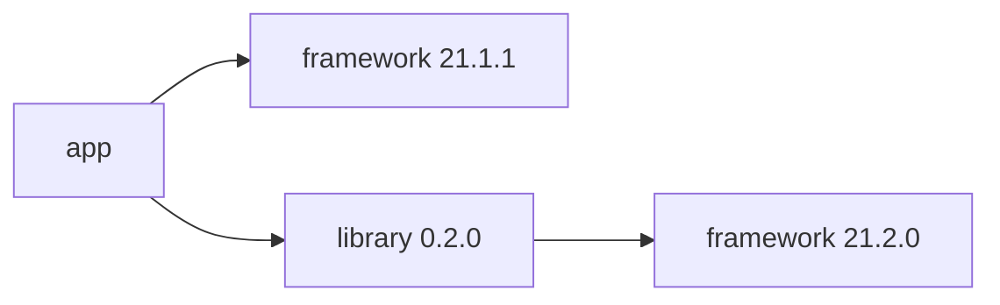
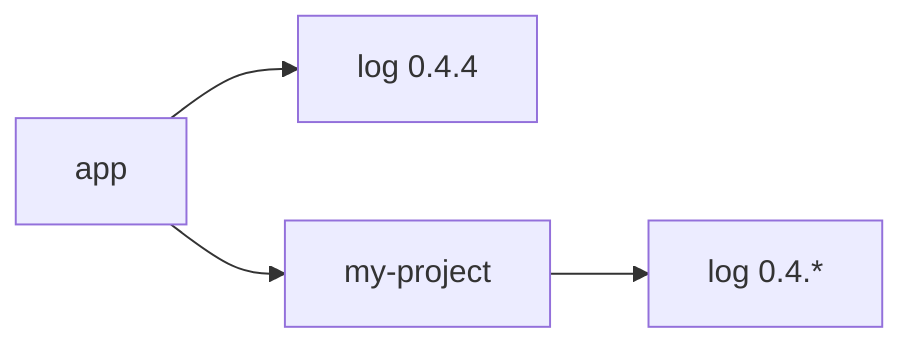
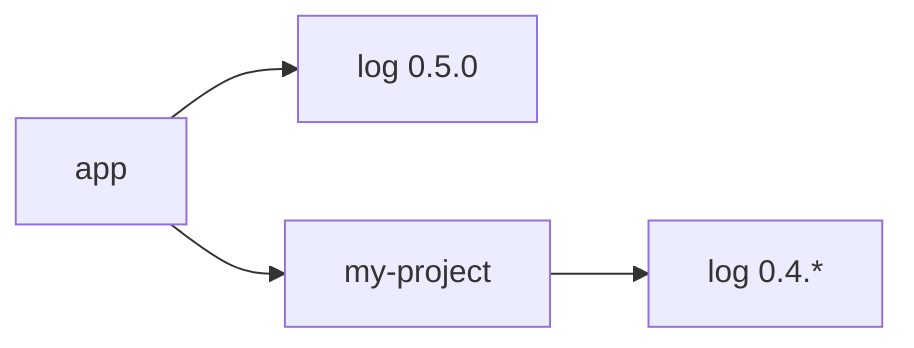

+++
title = "How Rust Solved Dependency Hell"
author = "Stephen Coakley"
date = "2019-04-24"
tags = ["rust"]
+++

Every once in a while I'll be involved in a conversation about dependency management and versions, often at work, in which the subject of "dependency hell" will come up. If you're not familiar with the term, then I encourage you to look it up. A brief summary might be: "The frustration that comes from dealing with application dependency versions and dependency conflicts". With that in mind, let's get a little technical about dependency resolution.

## The Problem

This topic typically enters into the discussion when debating on what kinds of dependencies a package should have, and which dependencies might cause problems. As a real-world example, at [Widen Enterprises] we have an internal, reusable Java framework that consists of several packages that gives us a base for creating many of our internal services (micro-services, if you will). This is fine and dandy, but what if you want to create a reusable library of shared code that depends on something in the framework? If you attempted to use a library like this in an application, you might end up with a dependency graph like this:



Just like in this example, any time you attempted to use the library in a service, there's a high chance that your service and the library will depend on different versions of the framework, and this is when "dependency hell" begins.

Now at this point, a good development platform will give you some combination of the following two choices:

- Fail the build and warn us that `framework` versions `21.1.1` and `21.2.0` clash with each other.
- Use [semantic versioning](https://semver.org) to allow packages to define a _range_ of versions they are _compatible_ with. If you're lucky, the set of versions that both packages are compatible with is non-empty, and you can automatically use one of those in the final application.

Both of these seem reasonable, right? If two packages really aren't compatible with each other, then we simply can't use them together without modifying one or the other. It's a tough situation to be in, but the alternatives are usually much worse. In fact, Java is a good example of what _not_ to do:

- The default behavior is to allow multiple versions of the dependency to be added to the classpath (Java's way of locating classes). Which version actually gets used when the application needs a class from the library? In practice, the order classes are loaded varies between environments or even runs in a non-deterministic way, and so you really have no idea which one will be used. Yikes!
- Another option that we use at Widen is _forced version alignment_. This is similar to the second reasonable option from before, except in Java land there's no way for dependencies to express a compatibility range and so we just pick the newer of the possible dependencies and cross our fingers that it will still work. In the dependency graph example shown earlier, we would force `app` to upgrade to `framework 21.2.0`.

This seems like a lose-lose situation, so as you can imagine, we're _very_ adverse to adding dependencies, and indeed have made it a defacto policy that _nothing_ is allowed to depend on our core framework except actual applications.

## Rust's Solution

When having these kinds of discussions, I'll often mention in passing that this is a problem that doesn't apply to all languages, and that Rust "solved" this problem as an example. I do often joke about how Rust solves all the world's problems, but there's usually a kernel of truth in there somewhere. So let's dive in to what I mean when I say that Rust "solved" this problem and how it works.

Rust's solution involves a fair number of moving parts, but it essentially boils down to challenging a _core assumption_ that we have made up until this point:

> Only one version of any given package should exist in the final application.

Rust challenges this in order to reframe the problem to see if there's a better solution sitting just outside of dependency hell. There are primarily two features of the Rust platform that work in tandem to provide the groundwork for solving these kinds of dependency problems, and today we'll look at both individually and what the result looks like.

### Cargo and Crates

The first piece of the puzzle is naturally Cargo, the official Rust dependency manager. Cargo is similar to tools like NPM or Maven, and has some interesting features that make it a really high quality dependency manager (it's my favorite along with [Composer], a really well designed dependency manager for PHP). Cargo is responsible for downloading Rust libraries, called _crates_, that your project depends on, and orchestrates calling the Rust compiler for you to get a final result.

_Note that crates are a first-class construct in the compiler. This will be important later._

Like NPM and Composer, Cargo allows you to specify a _range_ of dependency versions that your project is compatible with based on the compatibility rules of [Semantic Versioning]. This allows you to describe one or _more_ versions that are (or might be) compatible with your code. For example, I might add

```toml
[dependencies]
log = "0.4.*"
```

to my `Cargo.toml` file to indicate that my code works with any patch version of the `log` crate in the `0.4` series. Perhaps in a final application we get this dependency tree:



Since in `my-project` I declared compatibility with `log` version `0.4.*`, we can safely select version 0.4.4 for `log` since it meets all the requirements. (If the `log` crate follows the principles of semantic versioning, which admittedly isn't always the case for published libraries, then we can be mostly assured that this bump did not include any breaking changes that would break our code.) You can find a better explanation of version ranges and how they apply to Cargo in [the Cargo docs](https://doc.rust-lang.org/cargo/reference/specifying-dependencies.html).

Great, so instead of bailing if we have a version conflict or simply choosing the newer one and crossing our fingers, we can instead choose the newest versions of everything that satisfies _every_ project's version requirements. But what if we reach something unsolvable, like this:



There's no version of `log` that can be chosen that meets all the requirements! What do we do next?

### Name Mangling

In order to answer that question, we need to talk about _name mangling_. Generally speaking, name mangling is a process used by some compilers for various languages that takes a symbol name as input and produces a simpler string as output that can be used to disambiguate similarly-named symbols at link time. For example, Rust lets you re-use identifiers across different modules:

```rust
mod en {
    fn greet() {
        println!("Hello");
    }
}

mod es {
    fn greet() {
        println!("Hola");
    }
}
```

Here we have two different functions named `greet()`, but of course this is fine to do because they're in different modules. This is handy, but generally application binary formats don't have the concept of modules; instead all symbols exist in a single global namespace, very much like names in C. Since `greet()` can't show up twice in the final binary file, compilers might use more explicit names than your source code does. For example:

- `en::greet()` becomes `en__greet`
- `es::greet()` becomes `es__greet`

Problem solved! As long as we ensure that this name mangling scheme is deterministic and is used everywhere during compilation, code will know how to reach for the correct function.

Now this isn't an entirely complete name mangling scheme, because there's a lot of other things we haven't accounted for, like generic type parameters, overloading, and such. This feature also isn't unique to Rust, and indeed has been used for a very long time in languages such as C++ and Fortran.

How does name mangling help Rust solve dependency hell? It's all in Rust's name mangling scheme, which seems to be fairly unique across the languages that I looked into. So let's look under the hood, shall we?

Finding the code for name mangling in the Rust compiler turned out to be easy; it's all in a file aptly named [`symbol_names.rs`](https://github.com/rust-lang/rust/blob/0550766699a6602a51e361e8cb2825b540b7cce8/src/librustc_codegen_utils/symbol_names.rs). I recommend reading the comments in this file if you want to learn a whole lot more, but I'll include the highlights. It seems there's four basic components incorporated in a mangled symbol name:

- The fully qualified name of the symbol.
- Generic type parameters.
- The name of the crate containing the symbol. (Remember how crates are first-class in the compiler?)
- An arbitrary "disambiguator" string that can be passed in through the command line.

When using Cargo, the "disambiguator" is supplied to the compiler by Cargo itself, so let's look in [`compilation_files.rs`](https://github.com/rust-lang/cargo/blob/8df842f5941f7e6c34db608c9bde4c5dcebfde01/src/cargo/core/compiler/context/compilation_files.rs) to see what that includes:

- Package name
- Package source
- Package version
- Enabled compile-time features
- A _bunch_ of other stuff

The end result of this complex system is that even the same function across different versions of a crate has a _different_ mangled symbol name, and thus can both coexist in a single application, as long as each component knows which version of the function to call.

### All Together Now

Now back to our "unsolvable" dependency graph from earlier:


With the power of dependency ranges, and Cargo and the Rust compiler working together, we can now actually solve this dependency graph by including both `log 0.5.0` _and_ `log 0.4.4` into our application. Any code inside `app` that uses `log` will be compiled to reach for symbols generated from version `0.5.0`, while code inside `my-project` will make use of symbols generated for version `0.4.4` instead.

Now that we see the big picture, this actually seems pretty intuitive and solves an entire swath of dependency problems that would plague users of other languages. This solution isn't perfect though:

- Since different versions produce different unique identifiers, we can't pass objects around between different versions of a library. For example, we can't create a `LogLevel` with `log 0.5.0` and pass it into `my-project` to use, because it expects a `LogLevel` from `log 0.4.4`, and they have to be treated as separate types.
- Any static variables or global state will be duplicated for each instance of a library, and they can't communicate without some hackery.
- Our binary size increases necessarily for every instance of a library we have included in our app.

These seem like worthwhile tradeoffs for Rust in order to solve the general use case, but for other languages, adopting something like this could be significantly more difficult. Taking Java as an example, Java _heavily_ relies on static fields and global state, so simply adopting Rust's approach wholesale would certainly produce broken code more times than not, whereas Rust is a bit more heavy-handed about limiting global state to a bare minimum. This design also says nothing about loading arbitrary libraries at runtime or reflection, both of which are popular features offered by many other languages.

## Conclusion

Rust's careful design in both compilation and packaging pays dividends in the form of (mostly) painless dependency management that often eliminates an entire class of problems that can be a developer's worst nightmare in other languages. While I certainly liked what I saw when I first started playing around with Rust, diving deep into the internals to see great architecture, thoughtful design, and well-reasoned tradeoffs being made is even more impressive to me. This was but one example of that.

Even if you aren't using Rust, hopefully this gives you a new respect for dependency managers, compilers, and the tough problems they have to solve. (Though I'd encourage you to at least give Rust a try, of course...)


[Composer]: https://getcomposer.org
[Rust]: https://www.rust-lang.org
[Semantic Versioning]: https://semver.org
[Widen Enterprises]: https://www.widen.com
